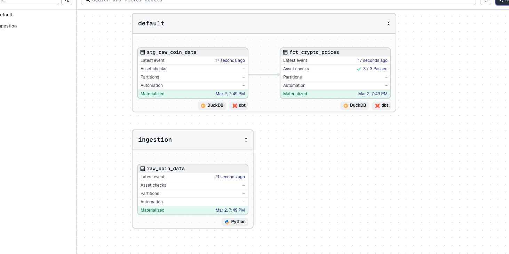
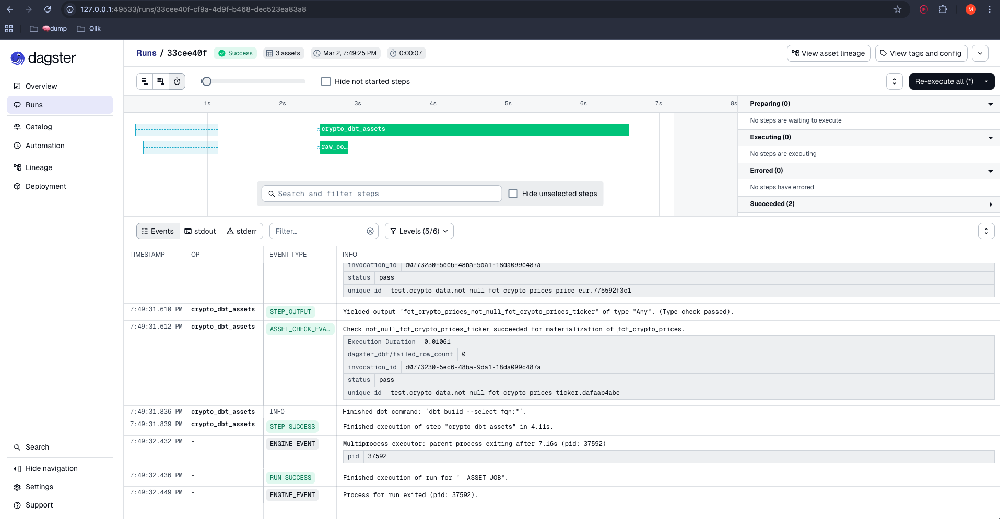
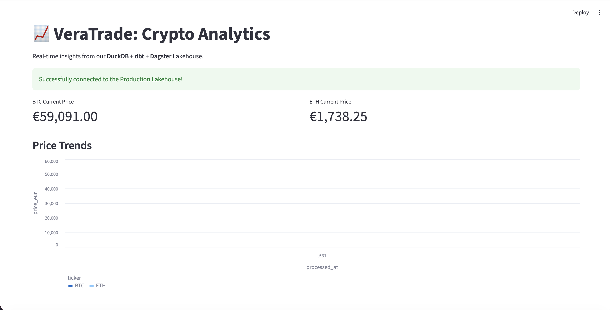

# 📈 VeraTrade: High-Veracity Crypto Data Platform

Why VeraTrade? It is a play on the Latin word "Veritas" (meaning truth) and the core mission of ensuring "High-Veracity" data.

## **Project Overview**

This project implements a modern "Asset-Centric" data pipeline designed for a 2026 FinTech environment. It transitions from traditional task-based processing to **Software-Defined Assets (SDAs)**, ensuring built-in lineage and observability.

## **The Architecture**

- **Ingestion:** Python-based harvester targeting CoinGecko API, utilizing **PyArrow** for high-performance columnar storage in Parquet format.

- **Storage:** Local Data Lakehouse architecture using **DuckDB** for in-process analytical processing.

- **Transformation:** Modular **dbt** modeling following a multi-layered (Staging/Marts) approach.

- **Orchestration:** Conceptualized for **Dagster** to leverage asset-based tracking and "re-execution from the middle".

## 🚀 End-to-End Orchestration & Observability

The pipeline is fully orchestrated using **Dagster**, moving beyond simple task-based execution to **Software-Defined Assets (SDAs)**.

### Data Governance & Quality

- **Automated Testing:** Integrated 3/3 dbt asset checks to ensure 0% null values and valid price ranges.
- **Lineage:** Full visibility from Python-based API ingestion to the final analytical mart.




### Real-Time Analytics

The final layer is a **Streamlit** dashboard that connects directly to the **DuckDB** Lakehouse, providing real-time price trends for BTC and ETH.



## **Data Contracts & Quality**

To achieve **accuracy**, this pipeline enforces:

- **Schema-on-Write:** Strict validation during the ingestion phase.

- **Automated Testing:** dbt tests for 'not_null' and price-range validation to prevent "data swamps".

- **Lineage:** Full visibility from raw API ingestion to final analytical models.


## **How to Run**

```bash
1. pip install -r requirements.txt
2. python ingest_prices.py
3. dbt run
4. dbt test
